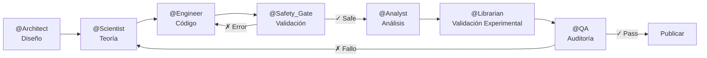

# Antigravity Nano Research Multiagentic Core

[](https://opensource.org/licenses/Apache-2.0)
[](https://github.com/google-deepmind/antigravity)
[](https://www.python.org/downloads/)

> **Sistema Multi-Agente para Investigación en Nanotecnología e Inteligencia Artificial**

Este repositorio contiene la infraestructura base para desarrollar **Investigación de Primer Nivel** en IA aplicada a Nanotecnología usando **Antigravity** como entorno de desarrollo multi-agente.

---

## 🚀 Quick Start (3 Pasos)

> [!IMPORTANT]
> **Requisito Previo**: Debes tener [Antigravity](https://github.com/google-deepmind/antigravity) instalado y configurado.

### 1. Clonar el Repositorio

Desde Antigravity, navega a tu directorio de proyectos y clona:

```bash
git clone https://github.com/ljyudico/Antigravity-Nano-Research-Multiagentic-Core.git
cd Antigravity-Nano-Research-Multiagentic-Core
```

### 2. Ejecutar Setup Automático

**Windows**:
```batch
setup.bat
```

**Linux/macOS**:
```bash
chmod +x setup.sh
./setup.sh
```

Este script:
- ✅ Crea el ambiente conda `ia_nano` (Python 3.11)
- ✅ Instala todas las dependencias científicas (ASE, RDKit, OpenMM)
- ✅ Registra el kernel Jupyter
- ✅ Verifica la instalación

### 3. Activar el Consejo de Expertos

```bash
conda activate ia_nano
jupyter lab
```

Ahora puedes trabajar con el sistema multi-agente exactamente como se usa en este proyecto.

---

## 🏗️ Arquitectura del Sistema

Este proyecto implementa un **Consejo de 7 Expertos** especializados:



### Agentes y sus Roles

| Agente | Responsabilidad | External Skills |
|--------|----------------|-----------------|
| **@Architect** | Guardián de la estructura y memoria del proyecto | `senior-architect`, `agent-memory-systems` |
| **@Scientist** | Dueño de la teoría, notación LaTeX perfecta | `claude-scientific-skills`, `research-engineer` |
| **@Engineer** | Constructor del código, implementación | `python-pro`, `ml-pipeline-workflow` |
| **@Safety_Gate** | Validación numérica, toxicología, pedagogía | `stability_guardian`, `toxicity_predictor`, `socratic_debugger` |
| **@Analyst** | Análisis profundo y visualización | `data-storytelling`, `descriptor_miner` |
| **@Librarian** | Validación experimental (Materials Project) | `librarian_rag` |
| **@QA** | Auditor supremo de calidad | `systematic-debugging`, `code-review-excellence` |

---

## 📦 Requisitos del Sistema

### Obligatorios

- **[Antigravity](https://github.com/google-deepmind/antigravity)** - Entorno de desarrollo multi-agente
- **Python 3.11** - [¿Por qué 3.11?](#por-qué-python-311)
- **Conda/Miniconda** - Gestor de ambientes
- **Git** - Control de versiones

### Opcionales

- **Node.js** - Para MCP servers (Materials Project integration)
- **CUDA** - Para aceleración GPU en OpenMM

---

## 📚 Documentación

- **[GOVERNANCE.md](GOVERNANCE.md)** - Roles del Consejo de Expertos y pipeline de trabajo
- **[INSTALL.md](INSTALL.md)** - Guía detallada de instalación y troubleshooting
- **[CONTRIBUTING.md](CONTRIBUTING.md)** - Cómo contribuir al proyecto
- **[SKILLS_ATTRIBUTION.md](SKILLS_ATTRIBUTION.md)** - Créditos y origen de las skills externas

---

## 🧬 External Skills

Este proyecto incluye **skills modulares** desarrolladas específicamente para validación científica:

### Numerical Skills
- `stability_guardian.py` - Validador de timesteps para MD
- `basis_set_architect.py` - Recomendador de bases Gaussianas para DFT

### AI Mining Skills
- `toxicity_predictor.py` - Predictor de toxicidad molecular

### Pedagogy Skills
- `socratic_debugger.py` - Generador de feedback pedagógico

### Orchestration Skills
- `librarian_rag.py` - RAG para validación experimental

Ver [SKILLS_ATTRIBUTION.md](SKILLS_ATTRIBUTION.md) para detalles completos.

---

## ❓ Por qué Python 3.11?

En el ecosistema científico, la **estabilidad** es tan crítica como el rendimiento:

1. **Compatibilidad Crítica**: Librerías fundamentales como `RDKit`, `ASE` y `OpenMM` tienen soporte nativo extremadamente estable en 3.11
2. **Rendimiento vs. Estabilidad**: Python 3.11 introdujo mejoras significativas de velocidad (Specializing Adaptive Interpreter) respecto a 3.10
3. **Reproducibilidad**: Al fijar esta versión, garantizamos que los notebooks sean ejecutables por estudiantes e investigadores en cualquier sistema operativo sin "infiernos de dependencias"

| Librería | Python 3.10 | Python 3.11 | Python 3.12 |
|----------|-------------|-------------|-------------|
| RDKit    | ✓ Estable   | ✓✓ Óptimo   | ⚠️ Beta      |
| ASE      | ✓           | ✓✓          | ✓           |
| OpenMM   | ✓           | ✓✓          | ❌          |

---

## 🤝 Contribuciones

¡Las contribuciones son bienvenidas! Por favor lee [CONTRIBUTING.md](CONTRIBUTING.md) antes de enviar un Pull Request.

### Áreas de Contribución

- 🔬 Nuevas skills para validación científica
- 📊 Mejoras en visualización de datos
- 🧪 Casos de prueba adicionales
- 📖 Documentación y tutoriales

---

## 📄 Licencia

Este proyecto está bajo la licencia **Apache-2.0**. Ver [LICENSE](LICENSE) para más detalles.

La licencia Apache-2.0 permite:
- ✅ Uso comercial
- ✅ Modificación
- ✅ Distribución
- ✅ Uso de patentes
- ⚠️ Requiere: Atribución y aviso de licencia

---

## 🔗 Enlaces Útiles

- [Antigravity Documentation](https://github.com/google-deepmind/antigravity)
- [Materials Project](https://materialsproject.org/)
- [ASE Documentation](https://wiki.fysik.dtu.dk/ase/)
- [RDKit Documentation](https://www.rdkit.org/docs/)

---

## 📧 Contacto

**Mantenedor**: ljyudico  
**GitHub**: [@ljyudico](https://github.com/ljyudico)

---

<div align="center">
  <sub>Desarrollado con ❤️ usando Antigravity para la investigación en Nanotecnología e IA</sub>
</div>
