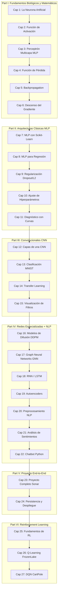

# Arquitectura del Cuaderno: UNIDAD_3_REDES_NEURONALES_FUNDAMENTOS

```mermaid
graph TD
    subgraph Part_I[Part I: Fundamentos Biológicos y Matemáticos]
        C1[Cap 1: La Neurona Artificial] --> C2[Cap 2: Función de Activación]
        C2 --> C3[Cap 3: Perceptrón Multicapa MLP]
        C3 --> C4[Cap 4: Función de Pérdida]
        C4 --> C5[Cap 5: Backpropagation]
        C5 --> C6[Cap 6: Descenso del Gradiente]
    end

    subgraph Part_II[Part II: Arquitecturas Clásicas MLP]
        C6 --> C7[Cap 7: MLP con Scikit-Learn]
        C7 --> C8[Cap 8: MLP para Regresión]
        C8 --> C9[Cap 9: Regularización Dropout/L2]
        C9 --> C10[Cap 10: Ajuste de Hiperparámetros]
        C10 --> C11[Cap 11: Diagnóstico con Curvas]
    end

    subgraph Part_III[Part III: Convolucionales CNN]
        C11 --> C12[Cap 12: Capas de una CNN]
        C12 --> C13[Cap 13: Clasificación MNIST]
        C13 --> C14[Cap 14: Transfer Learning]
        C14 --> C15[Cap 15: Visualización de Filtros]
    end

    subgraph Part_IV[Part IV: Redes Especializadas + NLP]
        C15 --> C16[Cap 16: Modelos de Difusión DDPM]
        C16 --> C17[Cap 17: Graph Neural Networks GNN]
        C17 --> C18[Cap 18: RNN / LSTM]
        C18 --> C19[Cap 19: Autoencoders]
        C19 --> C20[Cap 20: Preprocesamiento NLP]
        C20 --> C21[Cap 21: Análisis de Sentimientos]
        C21 --> C22[Cap 22: Chatbot Python]
    end

    subgraph Part_V[Part V: Proyecto End-to-End]
        C22 --> C23[Cap 23: Proyecto Completo Sonar]
        C23 --> C24[Cap 24: Persistencia y Despliegue]
    end

    subgraph Part_VI[Part VI: Reinforcement Learning]
        C24 --> C25[Cap 25: Fundamentos de RL]
        C25 --> C26[Cap 26: Q-Learning FrozenLake]
        C26 --> C27[Cap 27: DQN CartPole]
    end
```
