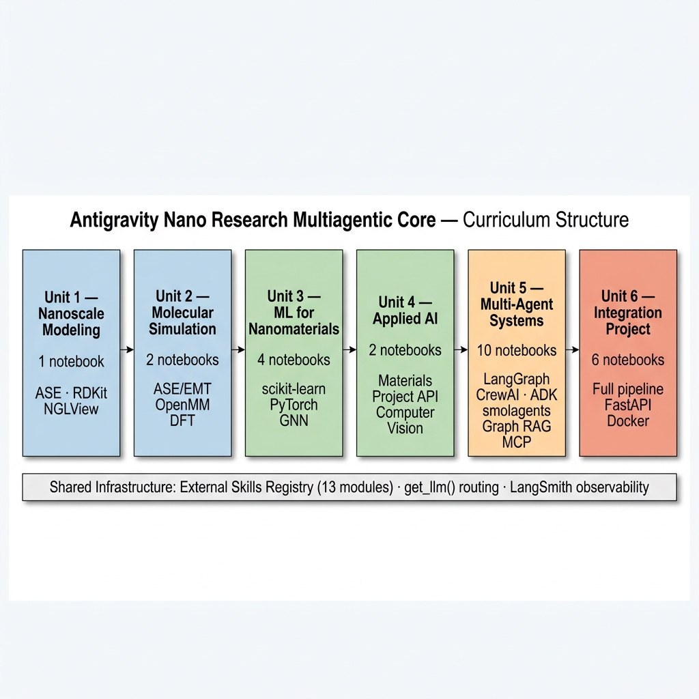
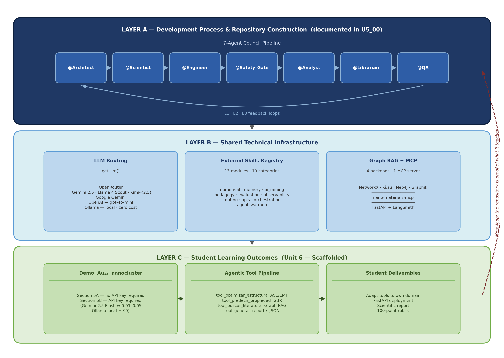

# Summary

**Antigravity Nano Research Multiagentic Core** is an open-source framework
that integrates multi-agent large language model (LLM) systems with
computational nanotechnology research and education. The system provides a
structured six-unit curriculum of 25 Jupyter notebooks that progressively
covers nanoscale simulation, machine learning for materials, and multi-agent
orchestration using LangGraph, CrewAI, Google ADK, smolagents, and LangChain
[@LangGraph2024; @CrewAI2024; @GoogleADK2025; @Smolagents2024].

A defining feature is accessibility: a fully reproducible demonstration
pipeline based on Au$_{13}$ nanoclusters (Unit 6, Section 5A) runs
end-to-end without any API keys or paid subscriptions, using only the
open-source Atomic Simulation Environment [@Larsen2017], scikit-learn
[@Pedregosa2011], and a mock graph retrieval module backed by NetworkX
[@NetworkX2008]. This zero-cost entry point covers the complete agentic
pattern; Section 5B connects the same tools to a live LLM and requires
at least one API key, with typical research sessions costing less than
\$0.05 using Gemini 2.5 Flash (~\$0.15/1M tokens) or \$0 with Ollama
local inference. Figure 1 illustrates the six-unit learning progression.

The framework targets graduate students, researchers, and educators in
computational materials science who wish to adopt AI-assisted workflows.
Crucially, the repository itself is a *living demonstration* of what it
teaches: it was co-developed by a seven-agent AI council (documented in
`U5_00_META_CONSTRUYENDO_CON_IA.ipynb`) using the same multi-agent stack
taught in Unit 5. This self-referential design — the system is proof of its
own pedagogy — is documented explicitly in the meta-notebook and illustrated
in Figure 2.

# Statement of Need

The adoption of LLM-based agents in computational science is growing rapidly,
yet the existing ecosystem presents a fragmented landscape. General-purpose
frameworks (LangGraph, CrewAI, Google ADK, smolagents, AutoGen, MetaGPT
[@MetaGPT2023]) do not address domain-specific scientific tools such as
atomistic simulators, materials databases, or spectroscopic data pipelines.
Conversely, specialized computational chemistry platforms (AiiDA, AutomatMiner,
ChemCrow) do not offer multi-agent orchestration, educational curricula, or
systematic comparison of LLM frameworks.

This gap has practical consequences: a researcher or instructor who wishes to
teach or prototype an AI-assisted nanotechnology workflow must integrate
multiple libraries without guidance on how to select, combine, or evaluate
frameworks. No existing open resource provides simultaneously (1) a complete,
executable curriculum with nanotechnology domain coverage, (2) a principled
comparison of seven major agent frameworks from the perspective of scientific
computing, and (3) a demonstration executable without paid API access.

**Accessibility and cost** represent an additional barrier that existing tools
do not address systematically. Table 2 summarizes the cost profile for
representative usage scenarios:

| Scenario | Estimated cost |
|:---------|:--------------|
| Demo Section 5A (complete Au$_{13}$ pipeline) | **\$0** — no API key required |
| Typical research session (Gemini 2.5 Flash, ~50 tool calls) | ~\$0.01–\$0.05 |
| Full month of use — active graduate student | **< \$5** |
| Fully local alternative (Ollama llama3.2) | **\$0** |

Cost estimates assume ~100K tokens per typical agent session at
\$0.15/1M tokens (Gemini 2.5 Flash pricing). Institutions without any API
budget can use the fully local Ollama path at zero cost.

**Antigravity Nano Research Multiagentic Core** addresses all three gaps
within a single, cohesive repository. Moreover, the meta-notebook `U5_00`
documents explicitly how an AI system (Antigravity) collaborated with the
human author to design the skill architecture, generate code, and audit
quality — making the development process itself a pedagogical case study in
human-AI collaboration for scientific software.

# Software Description

## System Architecture

The framework operates at three interdependent levels, illustrated in Figure 2.

**Development level (how the repository was built):** A seven-agent council
defined in `GOVERNANCE.md` — @Architect, @Scientist, @Engineer, @Safety\_Gate,
@Analyst, @Librarian, and @QA — co-developed the repository with the human
author using the Antigravity AI system. Each agent has specific responsibilities
and feedback loops (L1: safety validation; L2: experimental comparison;
L3: quality audit). This process is documented transparently in
`U5_00_META_CONSTRUYENDO_CON_IA.ipynb`.

**Infrastructure level (shared technical stack):** A modular layer shared by
the development process and the educational content.

**Student output level (what the learner produces):** Unit 6 provides
scaffolded notebooks where students implement their own scientific pipeline
using the tools from Units 1-5, deploy it as a FastAPI service, and document
results with a formal 100-point rubric.

## Curriculum Structure

The six-unit curriculum (25 notebooks total) covers a progressive learning
path, as summarized in Table 1:

| Unit | Topic | Notebooks | Key Technologies |
|:-----|:------|----------:|:----------------|
| 1 | Nanoscale Modeling | 1 | ASE [@Larsen2017], RDKit, NGLView |
| 2 | Molecular Simulation (MD, DFT) | 2 | ASE/EMT, OpenMM |
| 3 | Machine Learning for Nanomaterials | 4 | scikit-learn [@Pedregosa2011], PyTorch |
| 4 | Applied AI in Nanotechnology | 2 | Materials Project API, Computer Vision |
| 5 | Multi-Agent Systems | 10 | LangGraph, CrewAI, ADK, smolagents, Graph RAG, MCP |
| 6 | Integration Project | 6 | Full pipeline, FastAPI, Docker |

Unit 5 is the largest unit (10 notebooks) and serves as the conceptual bridge
between the scientific domain knowledge of Units 1-4 and the end-to-end
integration of Unit 6. A dedicated meta-notebook (`U5_00`) documents
the development methodology itself.

## Unified LLM Routing

A central utility function `get_llm()` provides transparent routing across
four LLM backends in priority order: (1) **OpenRouter** (cloud, multi-model
access — including Gemini 2.5, Llama 4 Scout, and Kimi-K2.5 as selectable
models), (2) **Google Gemini** (direct via `langchain_google_genai`),
(3) **OpenAI** (`gpt-4o-mini` by default), and (4) **Ollama** (fully local
inference, zero cost). The same notebook code runs regardless of the available
backend, enabling use in resource-constrained settings — institutions without
GPU clusters or paid API accounts — as well as production deployments.

## Au$_{13}$ Reproducible Demonstration

Unit 6, Section 5A implements a four-tool agentic pipeline for Au$_{13}$
nanocluster research that requires no API keys:

1. **`tool_optimizar_estructura`** — ASE/EMT geometry optimization
   [@Larsen2017]
2. **`tool_predecir_propiedad`** — Gradient Boosting Regressor prediction of
   cluster properties using scikit-learn [@Pedregosa2011]
3. **`tool_buscar_literatura`** — mock Graph RAG retrieval backed by
   NetworkX [@NetworkX2008]
4. **`tool_generar_reporte`** — structured JSON scientific report

Section 5B provides a scaffold (marked `[ESTUDIANTE: ...]`) where students
replace each tool with their own domain-specific calculators and connect them
to a LangGraph ReAct agent with a live LLM.

## External Skills Registry

The `external_skills/` package provides 13 Python modules organized in
10 categories, loaded via a central registry (`registry.py`) with semantic
versioning (`load_skill("episodic_retriever@1.0.0")`):

| Category | Modules |
|:---------|:--------|
| `numerical` | `stability_guardian`, `basis_set_architect` |
| `memory` | `episodic_retriever`, `graph_memory` |
| `ai_mining` | `toxicity_predictor` |
| `pedagogy` | `socratic_debugger` |
| `evaluation` | `output_scorer` |
| `observability` | `trace_annotator` |
| `routing` | `task_classifier` |
| `apis` | `token_budget_guard`, `github_skill_loader` |
| `orchestration` | `librarian_rag` |
| `agent_warmup` | `context_loader` |

Scientific-domain modules include `stability_guardian` (MD timestep
validation), `basis_set_architect` (DFT basis set recommendation),
`toxicity_predictor` (molecular toxicity heuristics), and `librarian_rag`
(literature retrieval against Materials Project data).

## Graph RAG with Multiple Backends

Unit 5, notebook `U5_06`, implements Graph Retrieval-Augmented Generation
with four storage backends:

- **NetworkX** [@NetworkX2008] — in-memory prototype, zero server dependencies
- **Kùzu** [@Kuzu2023] — embedded graph database, no server required
- **Neo4j** — production graph database with Cypher query language
- **Graphiti** [@Graphiti2024] — episodic memory for stateful, long-running agents

A decision table guides users through backend selection based on data volume,
query type (factual, relational, temporal, multi-hop), and deployment constraints.

## Model Context Protocol Integration

Notebook `U5_04` implements a `nano-materials-mcp` server [@MCP2024] that
demonstrates the Model Context Protocol pattern by exposing nanomaterials
property query tools (`get_nano_properties`, `compare_materials`) over stdio.
This establishes a reproducible, LLM-agnostic interface between orchestrators
and domain-specific scientific tools — the same pattern that, in a production
deployment, would wrap the ASE-based calculators from Units 1–4. Any framework
that supports MCP (Google ADK, LangChain, CrewAI) can consume the server
without code changes, a necessary condition for reproducible AI-assisted
science.

## Production Deployment and Observability

Unit 6 (`U6_04`) provides a FastAPI [@FastAPI2018] template using the modern
`lifespan` context manager pattern, with a production-ready `Dockerfile`
adaptable to any student project. Any pipeline built in Unit 6 can be served
as a REST API without additional configuration, bridging the gap between a
working research prototype and a deployable scientific service.

Agent observability is provided through LangSmith [@LangSmith2024] integration
across all Units 5-6 notebooks, recording per-node token usage, latency, tool
invocations, and errors for every agent run. This gives researchers a
reproducible audit trail of every agent decision — the computational equivalent
of a laboratory notebook for AI-assisted workflows.

## Automated Test Suite

The project includes 102 automated tests across three modules, validated on
Python 3.11 with pytest 9.0.2:

- **`tests/test_unit05.py`** — 19 tests covering arithmetic safety parsing and
  External Skills module integrity (0.16 s total runtime)
- **`tests/test_unit03_parte2.py`** — 26 tests for neural network logic and
  numerical gradient validation
- **`tests/test_external_skills.py`** — 57 tests covering the full External
  Skills registry, including `context_loader`, `output_scorer`,
  `trace_annotator`, `token_budget_guard`, and `episodic_retriever`

GitHub Actions CI executes the full test suite on every push to `main`.

# Research Applications

The framework is currently integrated into a graduate-level course on computational nanotechnology at the Universidad de La Ciénega del Estado de Michoacán de Ocampo (UCEMICH), México, where it serves as the primary teaching platform for multi-agent AI workflows. The Au$_{13}$ reproducible pipeline (Unit 6, Section 5A) provides a zero-cost, self-contained entry point for adoption by research groups without GPU infrastructure or institutional API budgets. The modular External Skills architecture is domain-agnostic: any scientific discipline requiring LLM-assisted tooling can reuse the registry, routing, and observability layers while substituting domain-specific calculators. The transparent documentation of the AI-assisted development process in `U5_00_META_CONSTRUYENDO_CON_IA.ipynb` makes the repository a practical case study for research groups exploring human-AI collaboration methodologies for scientific software development.

# AI Usage Disclosure

This software and the accompanying paper were developed with substantive assistance from generative AI tools. The repository structure, skill module architecture, notebook curriculum, and test suite were co-designed with the Antigravity agent development IDE (Google), structured as a seven-agent council (@Architect, @Scientist, @Engineer, @Safety_Gate, @Analyst, @Librarian, @QA) as defined in `GOVERNANCE.md`. LLM API providers used were Google AI Studio (free tier), OpenRouter, and the Claude API (Anthropic). All generated code was reviewed, tested against the 102-test automated suite, and verified by the author. The complete AI-assisted development process is documented transparently in `U5_00_META_CONSTRUYENDO_CON_IA.ipynb`, and this transparency is itself a pedagogical contribution of the work.

# Acknowledgements

The development of this framework demonstrates the collaborative potential of
human-AI pair programming for scientific software: the repository structure,
skill architecture, and notebook curriculum were co-developed using Antigravity
(Google's agent development IDE), structured as the seven-agent council defined
in `GOVERNANCE.md`. API providers used during development were Google AI Studio
(free tier), OpenRouter, and the Claude API (Anthropic). The full development
process is documented transparently in `U5_00_META_CONSTRUYENDO_CON_IA.ipynb`,
making the repository itself a pedagogical case study in low-cost,
multi-provider human-AI collaboration for scientific software.

The author also thanks the teams behind the open-source tools that form the
technical foundation: ASE [@Larsen2017] (DTU Physics), LangGraph
[@LangGraph2024] and LangSmith [@LangSmith2024] (LangChain Inc.), smolagents
[@Smolagents2024] (Hugging Face), Google ADK [@GoogleADK2025] (Google LLC),
AutoGen [@AutoGen2023] (Microsoft Research), MetaGPT [@MetaGPT2023], the
Model Context Protocol [@MCP2024] (Anthropic), Kùzu [@Kuzu2023], Graphiti
[@Graphiti2024] (Zep AI), FastAPI [@FastAPI2018], NetworkX [@NetworkX2008],
scikit-learn [@Pedregosa2011], and NumPy [@Harris2020].

This work was carried out at the Universidad de La Ciénega del Estado de
Michoacán de Ocampo (UCEMICH), México.

# References
